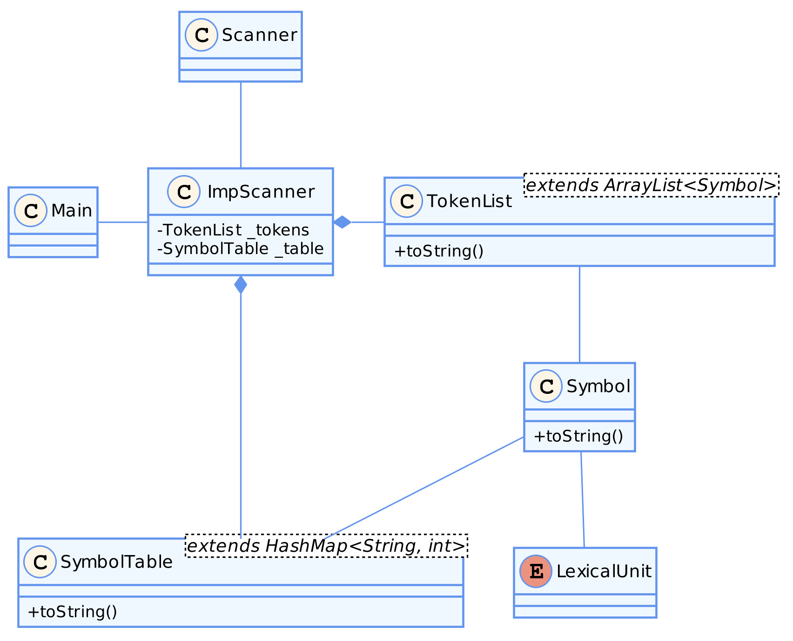

# INFO-F403-IMP
Project of course INFO-F403

## Suggested code organization

Here are the [pantuml doc](http://plantuml.com/class-diagram) and the [online image genrator](http://www.plantuml.com/plantuml/uml/SyfFKj2rKt3CoKnELR1Io4ZDoSa70000) links.

## Folder

- `doc` contains the Javadoc and the Report;
- `test` contains example files;
- `dist` contains the executable Jar;
- `more` contains all other files (order, ...);
- `src` contains source code;
- `srcTest` contains test code;
- `assets` contains files use by the application.